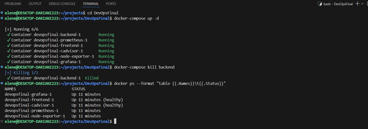
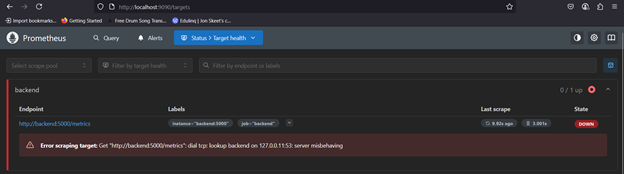
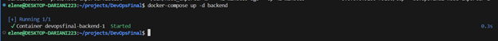

# Post-Mortem: Backend Service Outage (Simulated)

## Summary
- **Date**: 2025-06-28
- **Duration**: 10 minutes 23 seconds
- **Scope**: Backend API service disruption
- **Resolution**: Manual container restart

## Incident Timeline
| Time     | Event                                | Evidence |
|----------|--------------------------------------|----------|
| 00:00    | Backend container manually terminated |  |
| 00:01    | Monitoring systems detected outage   |  |
| 00:10    | Recovery process initiated           |  |
| 00:10:23 | Full service restored                |  |

## Key Observations
1. System behavior during outage:
   - Frontend services remained available
   - Monitoring tools successfully captured the event
   - All dependencies functioned as expected

2. Recovery process:
   - Standard restart procedure executed
   - Service restored to full functionality
   - Historical metrics preserved

## Resolution
```bash
docker-compose up -d backend


